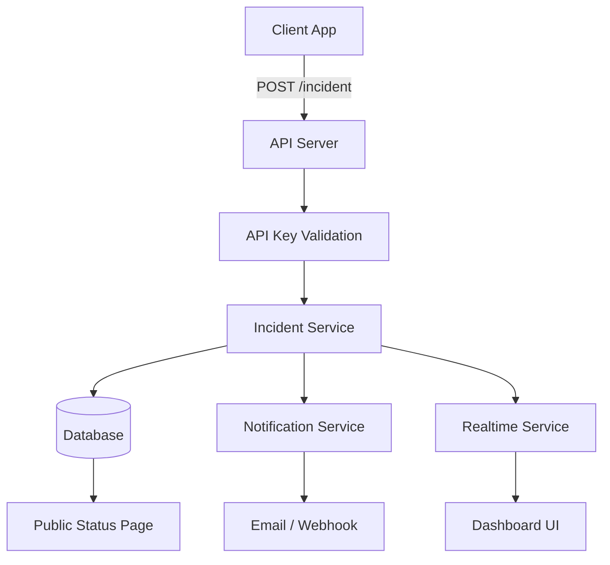
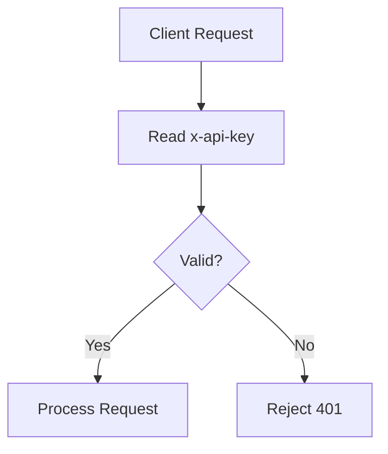
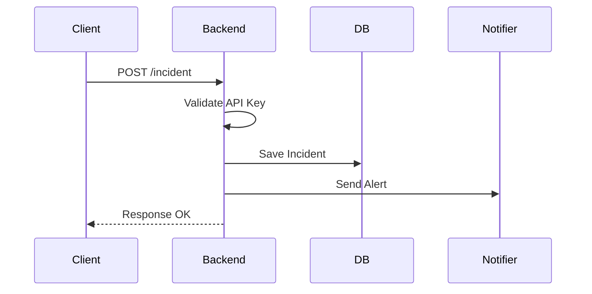
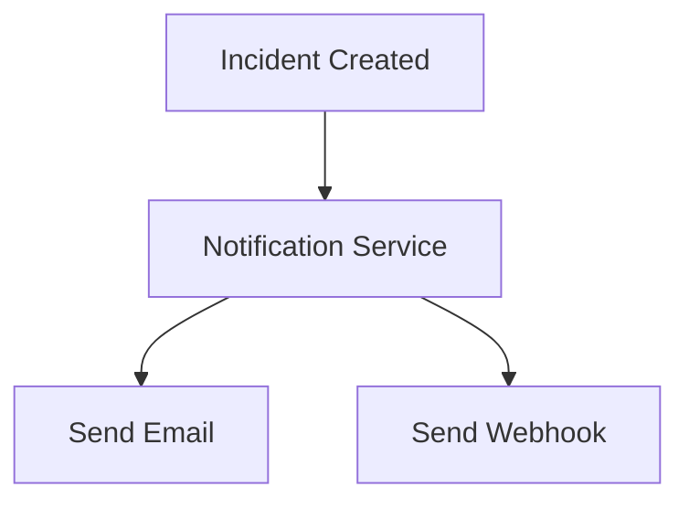
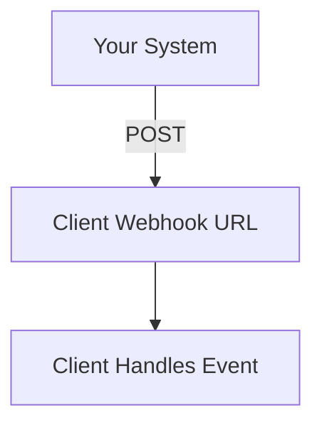
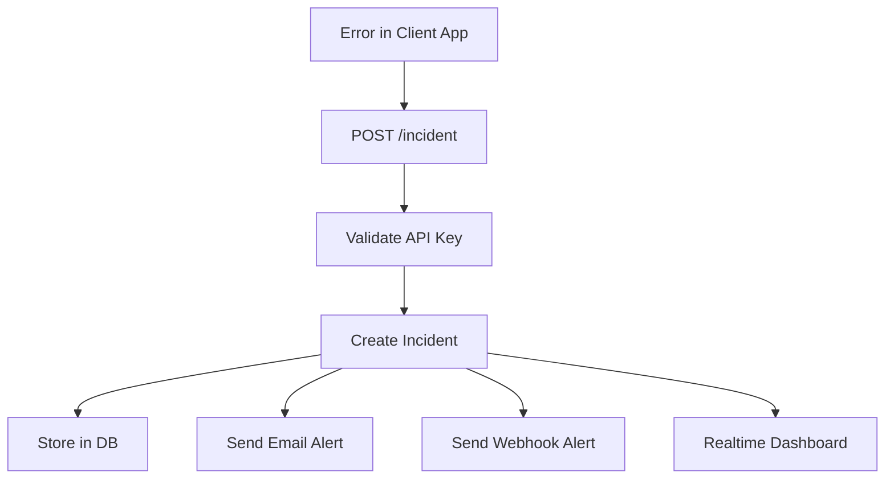

# 🚀 Incident Response SaaS (API Key + Webhook) — Complete Guide

---

## 🧠 What You Are Building

A platform where:

* 🧑‍💻 Developers send errors from their apps
* 🧠 Your system processes incidents
* 🔔 You notify teams (Email/Webhook)
* 📊 You show everything in a dashboard

👉 Inspired by:

* Sentry
* PagerDuty

---

## 💡 Core Idea (Super Simple)

> Client sends error → I store it → I notify team → I show dashboard

---

## 🏗️ Full System Architecture



---

## 🔑 API Key System (Security)



👉 API Key = identity of client app
👉 Sent in every request

```http
x-api-key: user_abc123
```

---

## 🔄 Complete Incident Flow



---

## 📦 Payload (Client Sends)

```json
{
  "message": "Payment failed",
  "service": "checkout",
  "severity": "high"
}
```

👉 Keep payload simple
👉 ❌ Don't send email/phone here

---

## 🧾 User Configuration (Stored in DB)

```js
{
  apiKey: "user_123",
  email: "dev@company.com",
  webhookUrl: "https://theirapp.com/webhook"
}
```

👉 This is VERY IMPORTANT
👉 Config comes from DB, not payload

---

## 🧩 Backend Routes (Core)

### 🔹 1. Create Incident

```http
POST /incident
```

**What it does:**

* Accept error from client
* Validate API key
* Create incident
* Trigger notification

---

### 🔹 2. Get Incidents

```http
GET /incidents
```

👉 Used for dashboard

---

### 🔹 3. Public Status

```http
GET /status
```

👉 Shows system health

---

## 🔔 Notification Flow (Webhook + Email)



---

## 🌍 Webhook Flow



### Example Payload:

```json
{
  "event": "incident.created",
  "data": {
    "message": "Payment failed",
    "severity": "high"
  }
}
```

---

## 💻 Backend Example Code

```js
app.post("/incident", async (req, res) => {
    const apiKey = req.headers["x-api-key"];

    const user = findUser(apiKey);
    if (!user) {
        return res.status(401).json({ message: "Unauthorized" });
    }

    const incident = {
        id: Date.now(),
        ...req.body,
        status: "open",
        createdAt: new Date()
    };

    // Save to DB
    db.push(incident);

    // Send Email
    sendEmail(user.email, incident);

    // Send Webhook
    if (user.webhookUrl) {
        sendWebhook(user.webhookUrl, incident);
    }

    res.json({
        message: "Incident created",
        incident
    });
});
```

---

## ⚡ End-to-End Flow



---

## 🧠 Important Rules

* ✅ Payload = only error info
* ✅ Config = stored in DB
* ✅ API = receive data
* ✅ Webhook = send data

---

## ❌ Avoid These Mistakes

* ❌ Sending email in payload
* ❌ Calling webhook everywhere
* ❌ Mixing error + event logic
* ❌ Overcomplicating (chat/phone)

---

## 🎯 MVP (Must Build)

* ✅ POST /incident
* ✅ API key validation
* ✅ Store incidents
* ✅ Dashboard

---

## 🚀 Advanced (If Time)

* 🔁 Webhook retry
* 📊 Incident timeline
* 🤖 AI summary
* ⚡ Realtime updates

---

## 💬 Final One-Line

> Client sends error via API key → store incident → notify via webhook/email

---

🔥 You now understand webhook + API system at an industry level.
