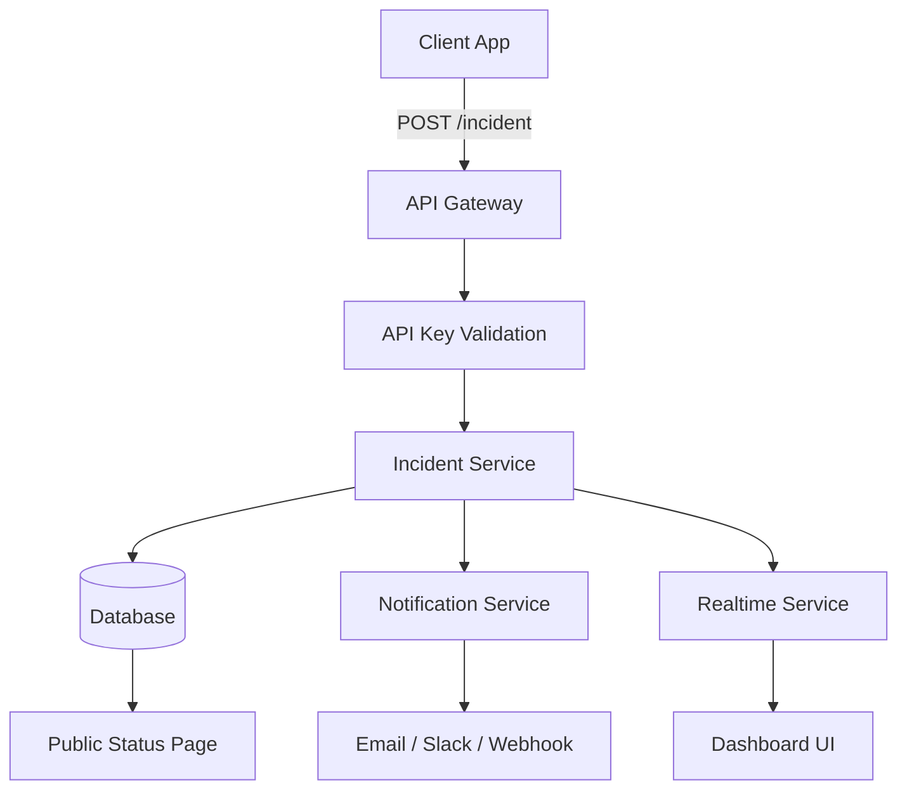
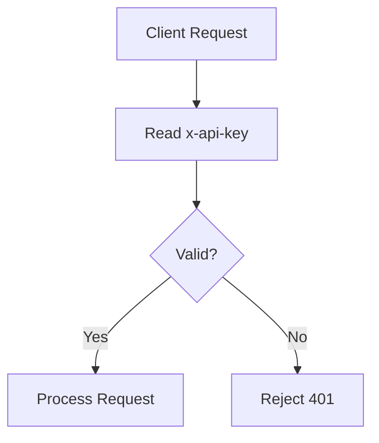
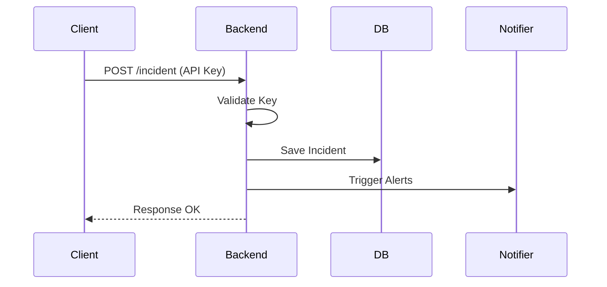
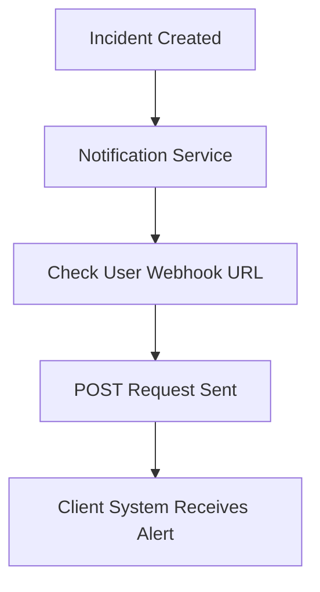
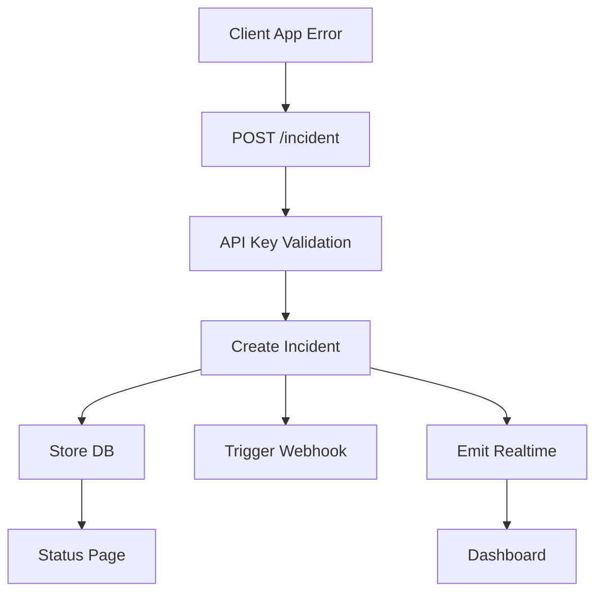

# 🚀 Smart Incident Response Platform (Webhook + API Key System)

---

# 📌 1. What You Are Building

A SaaS platform where:

* Applications send errors → your API
* You create incidents
* You notify systems (via webhook)
* You show dashboard + public status

👉 Inspired by:

* Sentry
* PagerDuty

---

# 🧠 2. Core Concepts

* API = Client sends data to your server
* Webhook = Your server sends event to other systems
* API Key = Identify & authorize client apps

---

# 🏗️ 3. High-Level Architecture



---

# 🔑 4. API Key Flow



---

## 📌 API Key Rules

* Generated on user signup
* Stored in DB
* Sent in headers:

```http
x-api-key: user_abc123_secret
```

---

# 🔄 5. Complete Incident Flow



---

# 🧩 6. Backend Routes (IMPORTANT)

---

## 🔹 1. Create Incident

```http
POST /incident
```

### Purpose:

* Receive error/event from client

### Request:

```json
{
  "message": "Payment failed",
  "service": "checkout",
  "severity": "high"
}
```

### Flow:

* Validate API key
* Create incident
* Store in DB
* Trigger notification

---

## 🔹 2. Get Incidents

```http
GET /incidents
```

### Purpose:

* Show all incidents in dashboard

---

## 🔹 3. Public Status Page

```http
GET /status
```

### Purpose:

* Show system health publicly

---

## 🔹 4. Outgoing Webhook (CORE 🔥)

```http
POST (to external URL)
```

### Purpose:

* Notify external systems

---

# 🔔 7. Webhook Notification Flow (REAL USE)



---

## 📌 Example Webhook Payload

```json
{
  "event": "incident.created",
  "data": {
    "message": "Payment failed",
    "severity": "high"
  }
}
```

---

# 💻 8. Example Backend Logic

```js
app.post("/incident", async (req, res) => {
    const apiKey = req.headers["x-api-key"];

    if (!isValid(apiKey)) {
        return res.status(401).json({ message: "Unauthorized" });
    }

    const incident = req.body;

    // Save to DB
    await db.save(incident);

    // Send webhook (if configured)
    if (user.webhookUrl) {
        await fetch(user.webhookUrl, {
            method: "POST",
            body: JSON.stringify({
                event: "incident.created",
                data: incident
            })
        });
    }

    res.json({ message: "Incident created" });
});
```

---

# 📊 9. Full System Flow (End-to-End)



---

# 🔐 10. Security Considerations

* Use strong API keys
* Never expose keys in frontend
* Add rate limiting
* Validate webhook URLs
* Retry failed webhook calls

---

# ⚡ 11. Minimum Viable Product (MVP)

Build this first:

* POST /incident
* API key validation
* Store incidents
* Simple dashboard

---

# 🚀 12. Advanced Features (Hackathon Winning)

* Webhook retry system
* Incident timeline
* AI summary (root cause)
* Real-time updates (Socket.io)
* Multi-project API keys

---

# 💡 13. Final Mental Model

```text
Client App → calls your API → You store incident  
        |
        v
You → send webhook → notify systems
```

---

# 🎯 Final Summary

* API Key → identifies client
* API → receives incidents
* Webhook → sends alerts
* Dashboard → shows data

---

# 🏁 One Line

> "Clients send errors to my API using API keys, and I notify systems using webhooks."

---

🔥 Done — this is industry-level understanding.
