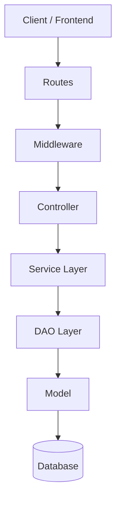
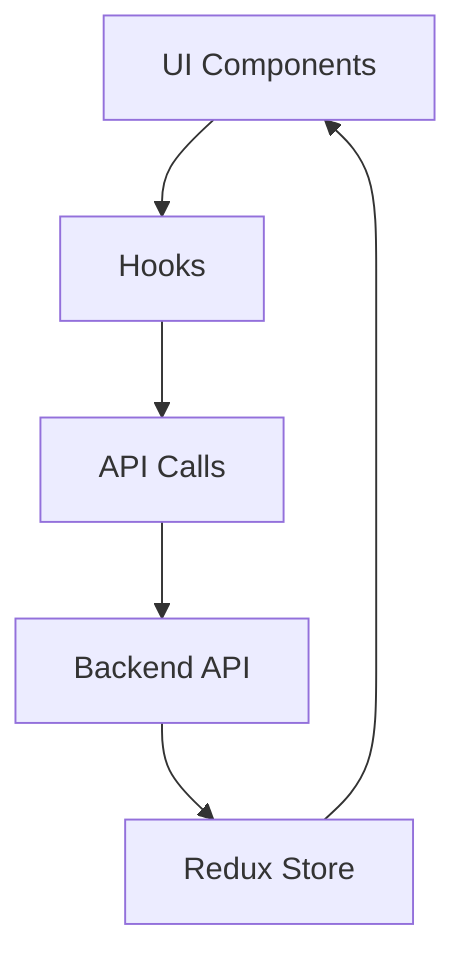
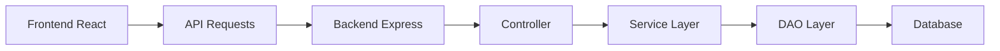
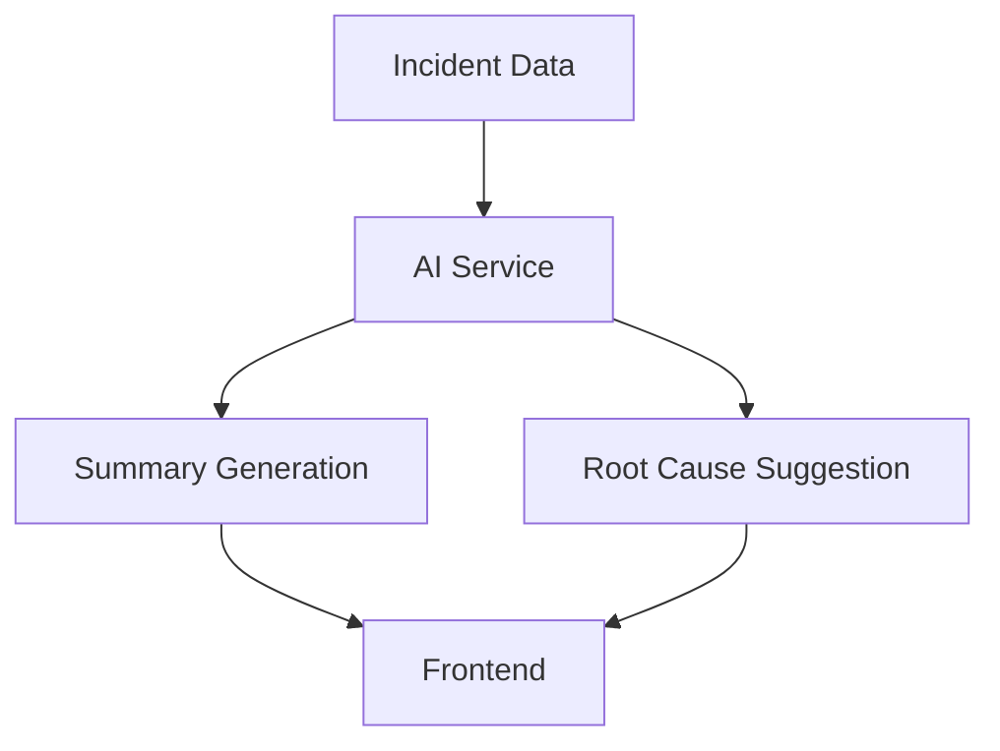

# 🚨 Incident Management System Architecture (MERN)

## 📌 Overview

This system manages **production incidents and outages**.

### 🚀 Features

* 🚨 Create & manage incidents
* 👥 Assign responders
* 📝 Post live updates
* ⏱️ Maintain timelines
* 📊 Generate postmortems
* 🌐 Public status page
* 🤖 AI summaries & root-cause suggestions

---

# 🧠 Architecture Summary

* 🖥️ **Backend:** Layered Architecture (MVC + Service + DAO)
* 🌐 **Frontend:** Feature-Based Architecture + Redux
* 🧩 **System Type:** Modular Monolithic

---

# 🧠 Backend Architecture

## ✅ Architecture Name

**🏛️ Layered Architecture (MVC + Service + DAO Pattern)**

---

## 📂 Folder Structure

```
backend/
├── public/                  # 🌐 Public status page
├── src/
│   ├── config/             # ⚙️ DB config, ENV
│   ├── controller/         # 🎮 Request handlers
│   ├── middleware/         # 🛡️ Auth, error handling
│   ├── model/              # 🗄️ Schemas (Incident, User, Timeline)
│   ├── dao/                # 📂 Data Access Layer (DB queries)
│   ├── routes/             # 🌍 API routes
│   ├── services/           # 🧠 Business logic
│   ├── utils/              # 🔧 Helpers
│   ├── validator/          # ✅ Validation
│   ├── app.js              # 🚀 Express setup
│   └── server.js           # 🎯 Entry point
└── package.json
```

---

## 🔄 Backend Flow Diagram



---

## 🎯 Layer Responsibilities

* 🌍 **Routes** → API endpoints
* 🎮 **Controller** → Request/Response handling
* 🧠 **Service** → Business logic (incident lifecycle, AI)
* 📂 **DAO** → Database queries & data access
* 🗄️ **Model** → Schema definitions
* 🛡️ **Middleware** → Auth, validation, logging
* ⚙️ **Config** → Environment setup

---

# 🌐 Frontend Architecture

## ✅ Architecture Name

**🧩 Feature-Based Architecture + Redux State Management**

---

## 📂 Folder Structure

```
frontend/
├── src/
│   ├── assets/             # 🖼️ Images
│   ├── features/           # 🧩 Modules
│   │   ├── incident/
│   │   │   ├── components/ # 🎨 UI
│   │   │   ├── hooks/      # 🔁 Logic
│   │   │   ├── api/        # 🌐 API calls
│   │   │   └── state/      # 📦 Redux slice
│   │   │
│   │   ├── status-page/
│   │   ├── user/
│   │   └── dashboard/
│   │
│   ├── routes/             # 🚦 Routing
│   ├── App.jsx             # 🧩 Layout
│   └── main.jsx            # 🚀 Entry
│
├── index.html
├── vite.config.js
└── package.json
```

---

## 🔄 Frontend Flow Diagram



---

# 🔗 Full System Architecture



---

# 🤖 AI Integration Layer



---

# 🧾 Final Summary

| Layer       | Architecture                  |
| ----------- | ----------------------------- |
| 🖥️ Backend | Layered (MVC + Service + DAO) |
| 🌐 Frontend | Feature-Based + Redux         |
| 🧩 System   | Modular Monolithic            |

---

# 🚀 Key Benefits

* ⚡ Clean separation of layers
* 🧠 Scalable & maintainable
* 👥 Team-friendly structure
* 🤖 AI-ready system
* 🌐 Supports real-time status visibility

---

# 🏁 Conclusion

This system follows modern architecture practices:

✅ Layered backend with DAO abstraction
✅ Modular frontend features
✅ Clear separation of concerns
✅ Ready for scaling & enhancements

👉 Result: **Robust and production-ready incident management system**

---
