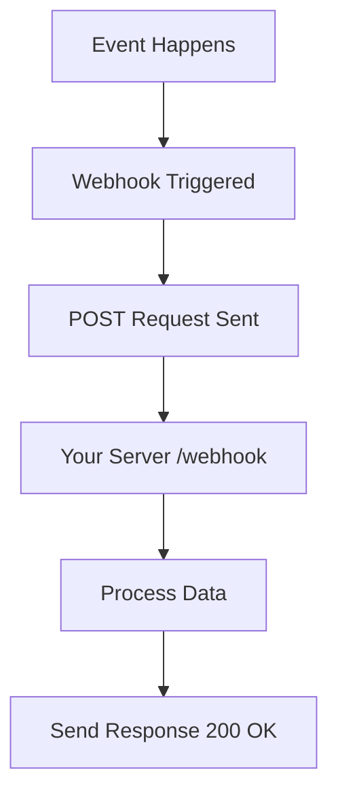
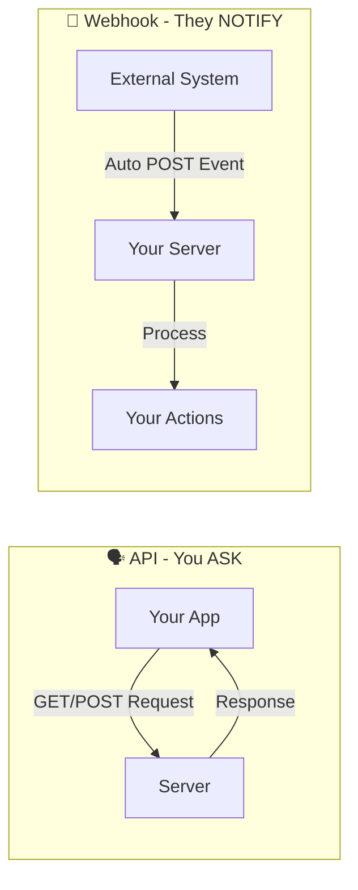
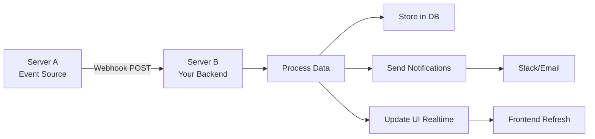
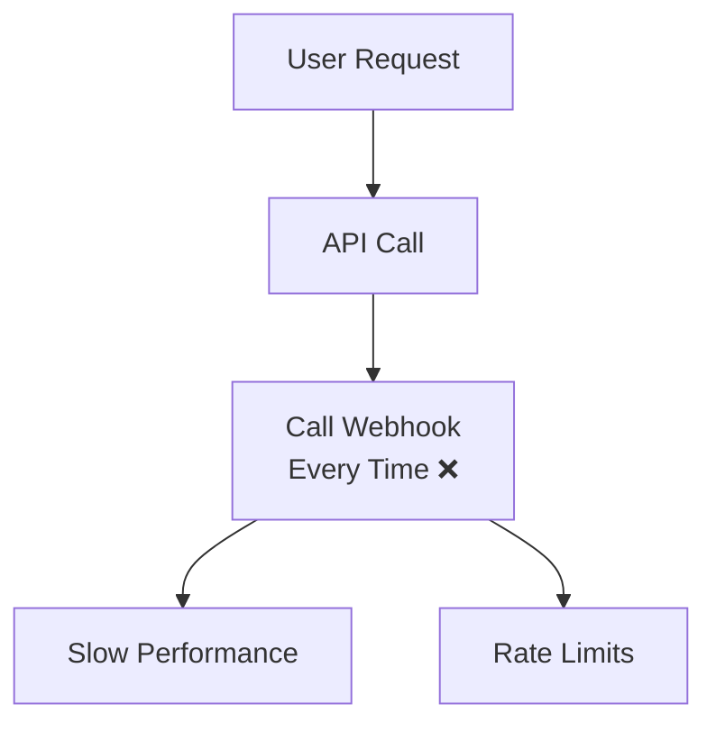
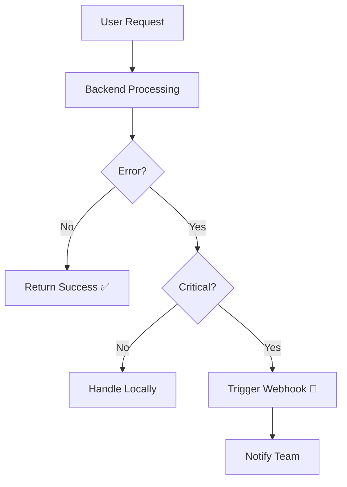
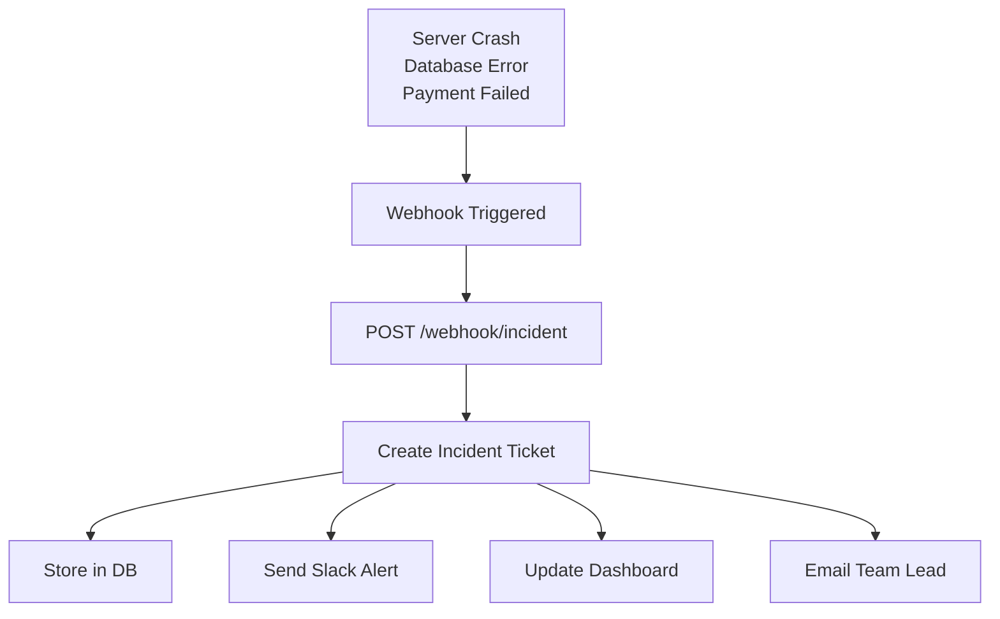
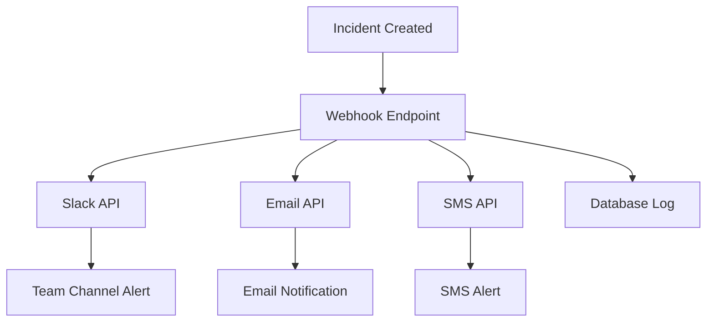
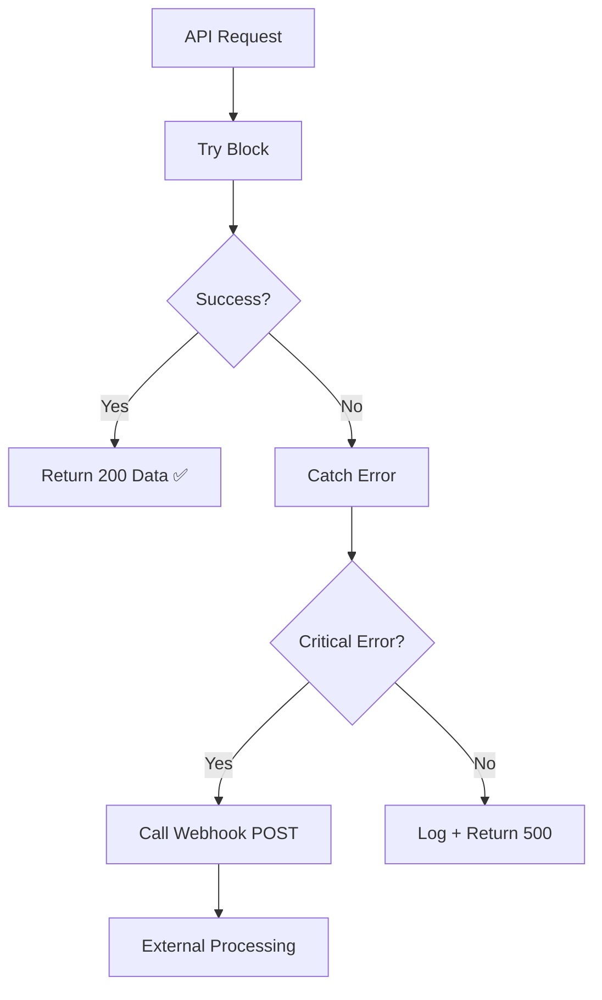
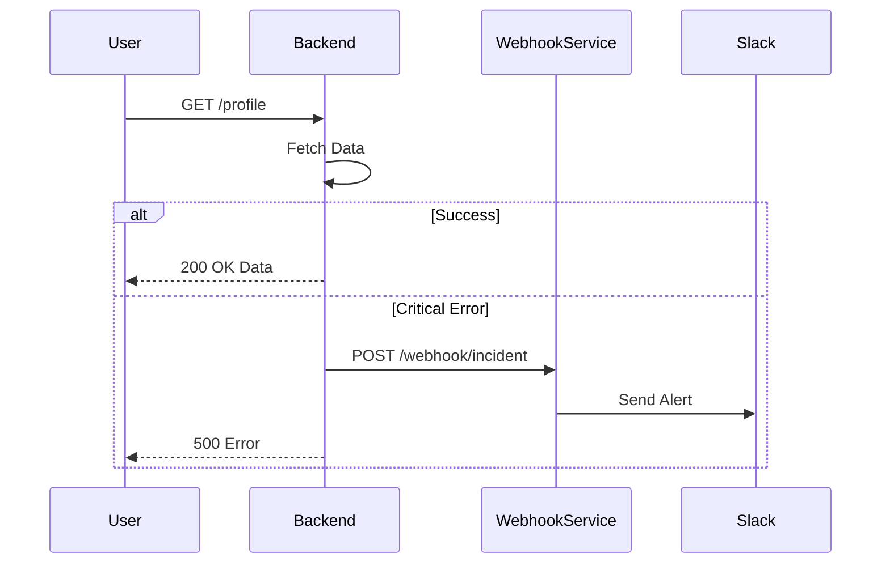
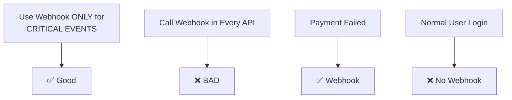

# 🚀 Webhook Understanding Guide (Simple + Practical)

---

# 📌 1. What is a Webhook?

**Webhook = When something happens in one system, it automatically calls another system.**

👉 Simple line:

> "Webhook is an automatic API call triggered by an event."

---

# 📊 2. Basic Flow (Core Concept)

---

# 🔁 3. API vs Webhook (Visual Comparison)

👉 **API = You call**  
👉 **Webhook = Someone calls you**

---

# 🏗️ 4. Two Server Architecture (Complete Flow)

---

# ⚠️ 5. WRONG vs RIGHT Usage

## ❌ Wrong Way (Don't do this)

**Problems:**
- Too many calls
- Performance issues  
- Not event-based

## ✅ Correct Way

---

# 🧠 6. Real Use Case (Your Hackathon Incident System)

---

# 🔔 7. Notification Flow (Multi-Channel)

---

# 💻 8. Backend Logic (Code Mental Model)

---

# 🧪 9. Example Event Flow (Sequence Diagram)

---

# 🔥 10. Golden Rules (Never Forget)

**Rules:**
- ✅ Use webhook **only for events**
- ❌ **Don't** call webhook in every API  
- ✅ Trigger **only for important actions**
- ✅ Use for notifications, incidents, automation

---

# 💡 Final Understanding

| Concept | Who Initiates? | When? | Example |
|---------|---------------|-------|---------|
| **API** | **You** | On Demand | GET /users |
| **Webhook** | **Others** | **Event Happens** | Payment Failed |

👉 **Best line to remember:**

> "Handle errors locally, notify globally using webhook."

---

# 🎯 You Now Know

✅ How webhook works  
✅ When to use it  
✅ When **NOT** to use it  
✅ How to design systems using it  

---

🚀 **Done** — revise this once and you'll **never forget webhooks**! 